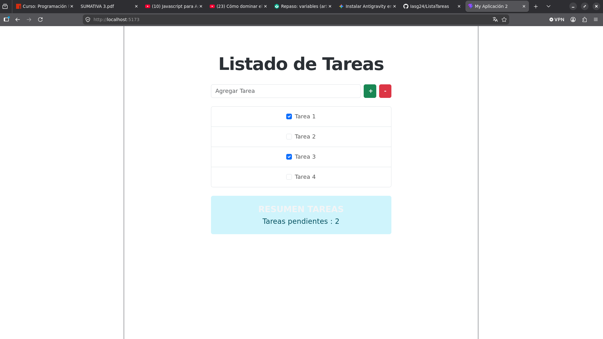
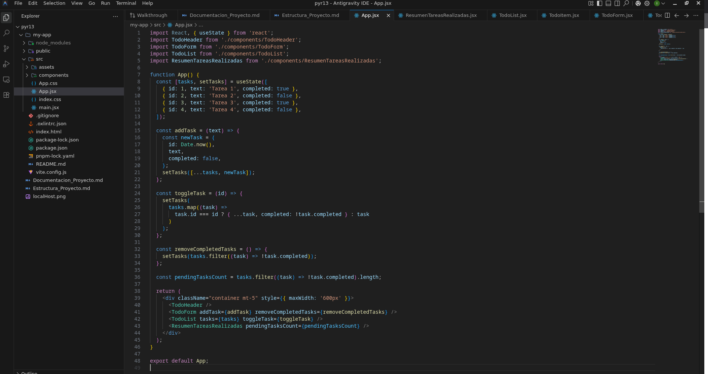

# Documentación Evaluación Sumativa III - Proyecto React + Vite

## 1. Estructura del Proyecto (Requerimiento A)
El proyecto ha sido generado utilizando Vite y estructurado de la siguiente forma:

- `node_modules/`: Dependencias.
- `public/`: Archivos estáticos.
- `src/`: Directorio principal.
  - `components/`: Contiene los componentes de la interfaz.
    - `TodoHeader.jsx`: Encabezado de la aplicación.
    - `TodoForm.jsx`: Formulario para agregar y eliminar tareas.
    - `TodoList.jsx`: Contenedor de la lista.
    - `TodoItem.jsx`: Tarea individual.
    - `ResumenTareasRealizadas.jsx`: Resumen de estado.
  - `App.jsx`: Componente principal y manejo de estado.
  - `main.jsx`: Punto de entrada y configuración de Bootstrap.

## 2. Estilos con Bootstrap (Requerimiento B)
Se ha incorporado Bootstrap 5 y Bootstrap Icons vía `pnpm`. Los estilos se aplicaron utilizando las clases utilitarias de Bootstrap, garantizando un diseño responsivo y limpio, centrándonos en:
- `TodoHeader`: Uso de clases de texto (`text-center`, `fw-bold`).
- `TodoForm`: Uso de clases de formulario y botones (`d-flex`, `form-control`, `btn-success`, `btn-danger`).
- `TodoList` y `TodoItem`: Clases de lista y alineación (`list-group`, `d-flex`, `align-items-center`).
- `ResumenTareasRealizadas`: Colores de fondo y espaciados (`text-center`, `p-4`, `rounded`, colores personalizados).

## 3. Incorporación de Componentes (Requerimiento C)
Se han desarrollado e integrado componentes funcionales locales para modularizar la aplicación:
- **`TodoHeader`**
- **`TodoForm`**
- **`TodoList`**
- **`TodoItem`**
- **`ResumenTareasRealizadas`**

## 4. Capturas de Pantalla (Requerimiento D)

### Captura de la Aplicación Funcionando


### Captura de la Estructura de Componentes en App.jsx

```javascript
// Principal bloque de código en App.jsx
  return (
    <div className="container mt-5" style={{ maxWidth: '600px' }}>
      <TodoHeader />
      <TodoForm addTask={addTask} removeCompletedTasks={removeCompletedTasks} />
      <TodoList tasks={tasks} toggleTask={toggleTask} />
      <ResumenTareasRealizadas pendingTasksCount={pendingTasksCount} />
    </div>
  );
```
